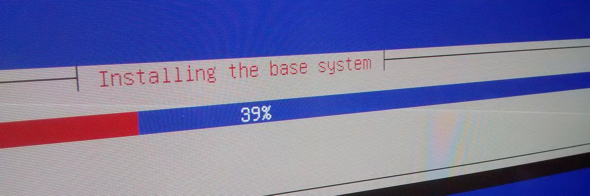

### Hi there 👋

<!--
**msevilla00/msevilla00** is a ✨ _special_ ✨ repository because its `README.md` (this file) appears on your GitHub profile.

Here are some ideas to get you started:

- 🔭 I’m currently working on ...
- 🌱 I’m currently learning ...
- 👯 I’m looking to collaborate on ...
- 🤔 I’m looking for help with ...
- 💬 Ask me about ...
- 📫 How to reach me: ...
- 😄 Pronouns: ...
- ⚡ Fun fact: ...
-->

I'm Miguel Sevilla-Callejo, Geographer, enthusiast of open and free tools and data, GNU/Linux user, OpenStreetMap contributor, QGIS user and more...

I moved almost all my repos to GitLab and you can find me there as [msevilla00](https://gitlab.com/msevilla00).

You could have information about me starting on [Twitter](https://twitter.com/msevilla00)
